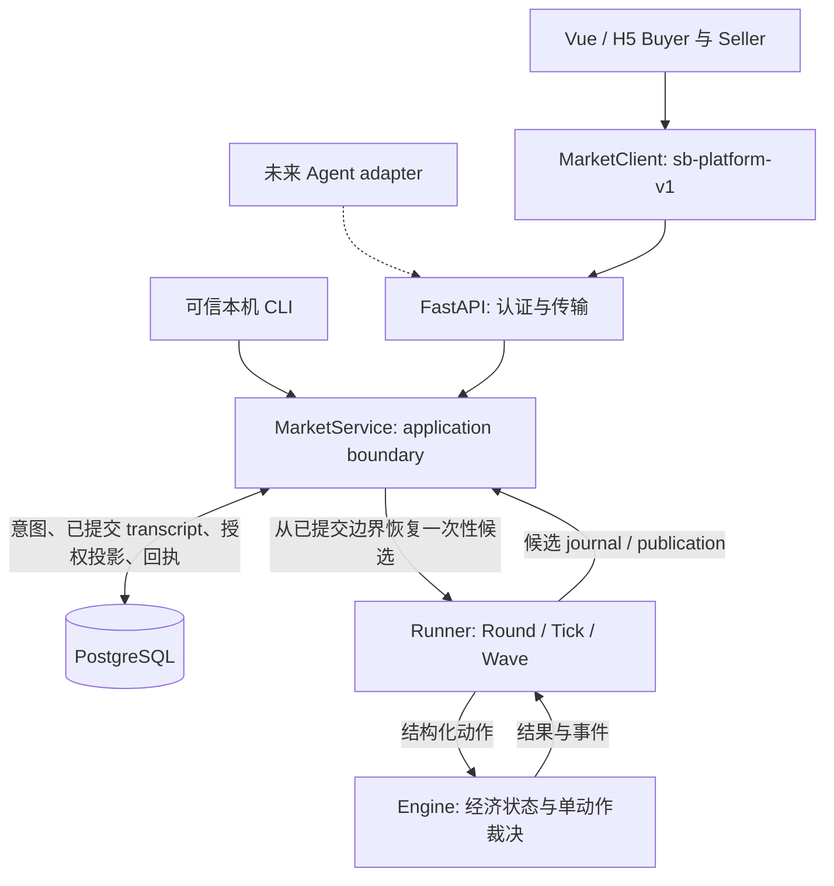

# SalesBench 当前框架

截至 SB-CONSOLIDATE-001（2026-09-24），项目已是可持久运行、可审计重放的本地多角色市场框架。Buyer/Seller Web 输入、HTTP 和未来 Agent 的接入点一致；经济行为仍是 TEST 规则，不等于已完成一个有正式消费者模型、策略和评价指标的 benchmark。

## 主链与唯一职责

PostgreSQL 是耐久权威存储，**不是 purchase 执行层**。FastAPI/MarketService 先保存请求，收齐 Wave 后从 DB 已提交记录恢复 Runner/Engine，执行候选，再提交整个边界；参与者只读 DB 中已经提交的授权投影。不会先把候选发给页面、以后再补数据库。

| 目录 / 模块 | 负责 | 不负责 |
| --- | --- | --- |
| `frontend/src/platform/`、`NetworkApp.vue` | actor binding、网络 DTO、轮询、草稿、原 ID 重试；Buyer/Seller 共用 MarketClient | 扣款、库存、裁决购买优先级 |
| `frontend/src/pages/`、`components/` | Buyer 五页、工程 Seller 操作台、Wave 与回执展示 | 正式消费者/经营策略、排名算法 |
| `backend/app/api.py`、`contracts.py` | HTTP envelope、bearer 认证、OpenAPI | 调用 Engine 绕过 Wave |
| `backend/app/service.py` | 会话绑定、持久幂等、收集、fencing、提交、恢复 | 另一套经济规则 |
| `backend/app/persistence.py`、`migrations/` | SQLAlchemy 10 张业务表、显式 Alembic 迁移 | 独立 SQL 订单撮合或账户结算 |
| `engine/src/salesbench_engine/runner/` | 冻结观察、Driver 收集、批次、顺序、publish、journal/replay | 平台身份、DB 事务 |
| `engine/src/salesbench_engine/` | Product/Offer/Inventory/Listing、权限、钱、订单/消息、revision、单动作原子性、step | UI、HTTP、数据库或真实模型调用 |
| `backend/app/manual.py`、`cli.py` | 宿主创建场次、只读 inspect/recover、确定性 smoke | 参与者全量数据 API、正式管理后台 |

Backend 通过锁定的本地包依赖引用 Engine，不复制其源码。Engine/Runner 可脱离 Vue、FastAPI 和 PostgreSQL 单独测试、运行；当前零第三方运行时依赖。Web/H5 是唯一参与者客户端方向，不建设桌面原生客户端。

## 一次机会如何落地

1. 绑定 token 决定 session/actor；观察包含共同 public snapshot 和本人的资金、库存、订单、私聊。页面不能用 actor_id 参数切换身份。
2. 页面只构造有限、有序草稿；明确提交后带原 publication、opportunity、request ID。新采购/消息/购买都走同一 `MarketService.submit`，获得 durable pending 或 rejected receipt。
3. 每个必需 actor 都提交后，平台 claim 新 fence，从 canonical transcript 恢复候选；SubmissionDriver 把持久意图交回原 Runner，不自动替缺席者 Wait。
4. Runner 决定合法批次及执行次序；Engine 唯一裁决钱、库存、报价、消息权限。Buyer purchase 至多一笔且在尾部；跨 Listing 的共享库存仍按同一 seeded resolver 排序。
5. 同事务落库 journal、action/batch receipt、resolution、事件、runtime、publication、授权 projection 和 outbox。DB COMMIT 即对外发布，无额外内存 publish 窗口。
6. 客户端轮询通知/观察/本人 receipt。pending 不表示成交；断线/COMMIT_UNKNOWN 保留原 ID 与原 envelope，查 receipt，未知时也只重发原请求。

单动作失败不会部分改钱/库存。**整批并非全有或全无**：V1 保留成功前缀，业务失败后其余动作 skipped，记录原因；失败传播语义后续需正式确认。技术故障与策略 Wait 分离。

恢复从初始 setup + 已记录动作重新执行并核对源码、协议、journal 与经济摘要。`snapshot()` 只是宿主导出，不是 restore contract。候选已执行但 DB 未提交可以丢弃；提交成功后进程退出可以从 DB 读取同一结果。`recover` 与 `inspect` 共用版本/经济摘要验证。完整故障矩阵见 [PLATFORM.md](PLATFORM.md)。

## 时间与版本

| 名称 | 当前含义 |
| --- | --- |
| Round | 每轮先一次 Seller procurement，再固定数量 Tick；正常关闭只 `advance(1)` 一次 |
| Tick | 一组配置 Wave；V1 为 SELLER_STRATEGY → BUYER_ACTION |
| Wave / opportunity | 同角色基于同一已发布公共版本决策，私有观察各自授权；每 actor 一个有序批次 |
| Engine step | 已正常关闭的 Round 数，从 0 开始；不是分钟、小时或某个模型返回 |
| published_version | 正常 Wave / Round close 提交后增加；DB projection/runtime 与其一致 |
| offer_revision | 实际改价或上下架增加；库存变化、同值赋值不增加 |
| content_revision | 实际销售描述变化增加，与报价版本独立 |

Seller 在本 Tick 的修改对同 Tick Buyer 生效；Buyer 的本 Wave 消息到下一相关 Wave 才可观察。模型耗时、HTTP 到达顺序、action ID 和 Python hash 不决定 purchase priority。市场/裁决 seed 与 provider/model/concurrency/timeout 配置分开。具体协议见 [RUNNER.md](RUNNER.md)。

## 当前路径、历史与本地材料

生产构建和默认开发入口始终使用真实平台。`frontend/src/demo/`、`services/bootstrap.ts`、`services/agent.ts` / `notConnected.ts` 是显式开发演示或旧契约测试夹具，只有开发时指定 `VITE_BUYER_SERVICE=demo` 才挂载演示；没有网络错误回退。

`scenario.py`、`runner/demo.py`、平台 `demo` 是明确命名的 deterministic smoke。它们调用相同 Engine；`create-manual` 只建 setup/绑定，**不代操参与者**。单元测试 fake provider 不等于真实 LLM 集成；浏览器 `test-market` 才是完整真实平台验收，`test-browser` 是历史 UI 回归。

`references/` 与历史 handoff/验收截图保持原样；历史文件描述各阶段当时的能力，不作为当前入口。`docs/INTERFACES.md` 是当前适配说明，旧 Vue 单动作演示契约在 `docs/history/`。

`.local/runtime.json` 放各机工具路径；`.local/platform.json` 放连接及管理凭据；`.local/manual/<sid>/` 放本机角色文件；`.local/verification/` 放每次回归产物。虚拟环境、node_modules、缓存与这些材料均忽略。PG 数据在仓库外；各机独立安装，不通过 Git 同步数据或凭据。详细路径与从零配置见 [ENVIRONMENT.md](ENVIRONMENT.md)。

## 已完成、未完成与 Known Issues

已完成 Buyer UI 迁移、独立 Engine、Market Wave Runner、PostgreSQL 持久平台、真实 Buyer/Seller 多窗口 E2E。可采购、上架/调价/改描述/上下架、公开/私聊、购买/Wait、查看真实订单/余额、重连、跨进程幂等、重启恢复与宿主审计。

| 分类 | 当前边界 / 缺口 |
| --- | --- |
| 工程能力 | 本地单 worker、小市场、完整历史重放；未做 checkpoint/归档、规模验证、HA、备份恢复演练、正式身份治理或公网部署。通知为 polling，无 WS/SSE |
| 真实模型接入 | LLMDriver / ModelAdapter 接口及 fake adapter 测试已有；真实 provider、模型运行凭据、成本/配额及真实模型实验未接入 |
| 研究组件 | Consumer Model、Seller/Supplier Policy 只有 scripted/test 实现；偏好、效用、策略、实验参数集与正式评价尚待研究设计 |
| 未定研究机制 | 正式排行榜/推荐/奖励、供给再生、真实时间映射、物流/退款/佣金/税费未定；Engine 的 TEST 榜单不在当前 Runner 公共投影启用 |
| 真人实验 | Seller/Buyer 手工 UI 是工程输入；不是 HumanDriver profile、正式账户、招募/同意/实验分配与真人实验协议 |

继续保留的限制：批次失败传播 Protocol Debt；未提交持续等待；源码不匹配的历史 trace 拒绝恢复，不能绕过 guard 升级；本机角色文件明文/sessionStorage 只适用于开发；私有 journal/inspect 仅供可信宿主，不能提供给参与者。经济 TEST 规则包括有限供应、即时交货与全额即时结算、共享库存，无完整履约机制。

## 下一阶段建议（未授权实施）

1. **明确最小研究 profile 与评价契约**：先确定比较什么、Consumer/Seller 的信息与行为假设、指标和批次失败传播的处理结论。保留当前协议基线，任何变更需显式版本和用户确认，避免把测试行为当研究结论。
2. **受控真实 LLM adapter 小试**：复用同一 application boundary/Runner，以一个 provider 验证结构化输出、预算、取消/失败、模型记录与重放；先验证实验输入可信，再扩展模型矩阵，不复制经济规则。
3. **可复现实验与数据交付**：固定已批准的 profile、seed、策略/模型配置与代码版本，形成重复运行、指标导出和访问权限明确的审计材料；用真实运行规模决定是否需要 checkpoint 或性能工程。

正式 HumanDriver/真人实验单独立项，不能把手工 E2E 直接改名为正式实验。上述里程碑均等待后续指令。
