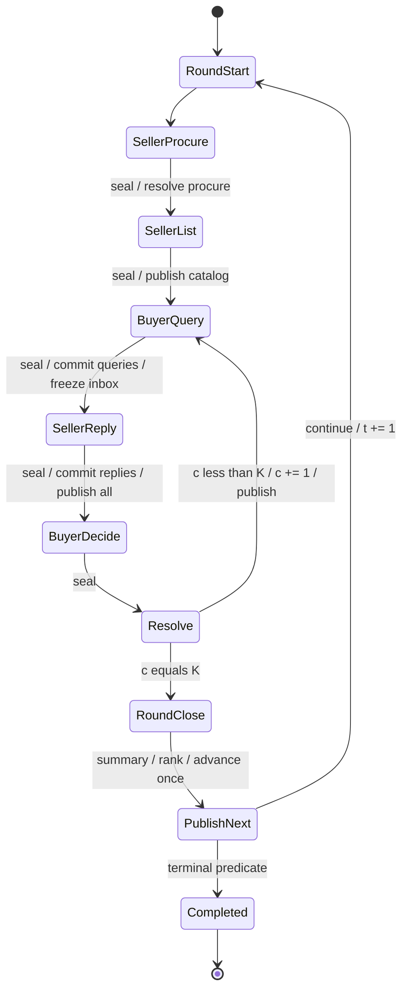

# BenchmarkRunner / Scheduler 设计 v0.1

SB-PROTOCOL-001 / 2026-09-23。**尚未实现。** 规范参数与经济机会以 [ROUND_PROTOCOL](ROUND_PROTOCOL.md) 为准，Human deadline/Ready 以 [HUMAN_SCHEDULER](HUMAN_SCHEDULER.md) 为准；本文只定义实现边界、状态和验收。

## 1. 职责和建议包结构

```text
Human H5 / scripted actor / future Agent Policy
                 ↓ structured proposals / controls
future FastAPI application adapter
  身份绑定、DTO、持久幂等、网络 receipt、DB 提交、通知
                 ↓
BenchmarkRunner（每 session 一个写者）
  current round / phase / cycle
  immutable observation epochs / opportunities
  action buffers / Ready / deadlines
  deterministic resolution order / semantic journal / termination
                 ↓ observe / execute / advance
Engine
  actor permissions / purchase validation / money / inventory
  orders / procurement / messages / state transitions / events
```

Runner 不复制库存、资金或 purchase validation，不产生新的成交规则；Engine 不等待现实倒计时、不决定网络请求谁先到；Policy 只拿授权观察并提出结构化意图；FastAPI 路由不写研究规则。

建议 Skeleton 在现有独立工程的 `engine/src/salesbench_engine/runner/` 新增独立子包，旧 `environment/actions/models/policies/rules/scenario` 保持行为与导入兼容。这样复用既有锁文件和 Python 运行环境，不增加 FastAPI/DB 依赖，也不在总仓库根创建另一个工具链。若实施时有明确包装限制，可将 Runner 作为同工程独立顶层包，但须验证 wheel 收录；不复制 Engine。

| 组件 | 职责 |
| --- | --- |
| `ProtocolConfig` / `RoundProtocol` | 版本化配置、状态转移表、角色/phase 动作白名单和预算 |
| `BenchmarkRunner` | session 内控制流程、调用 Engine、发布 epoch、终止与 journal |
| `Scheduler` | 纯调度判断：required actors、Ready、batch final、deadline、seal；不直接改经济状态 |
| `OpportunityStore` | 每 actor/window 的额度、slot、收件幂等、buffer/final |
| `ObservationBroker` | 先由 Engine observe 授权，再冻结组合视图与榜单；不向 participant 返回 snapshot() |
| `Resolver` | 根据规范 seed hash 排序、分波；逐项委托 Engine；无资金/库存副本裁决 |
| `ActorDriver` | scripted 输入或人工控制；未来 Policy adapter；不持有可写 Engine |
| `Journal` / `Clock` | 内存语义日志与 ingress 日志；可注入 FakeClock；不承担数据库事务 |

这些是职责，Skeleton 可合并成少量模块，避免为示意生成空目录。

## 2. 最小数据契约（Python 草案）

```python
WindowKey(round_index, phase, interaction_cycle)  # session 内唯一；重签发另有 generation
Opportunity(window_id, actor_key, role, observation_id, allowed_actions,
            slot_limits, deadline, final=False)
DecisionContext(window_id, observation_id, protocol_version, remaining_budget,
                observations, addressed_inbox, leaderboard_snapshot_id)
ActionEnvelope(action_id, window_id, observation_id, slot, payload,
               request_id=None, reply_to_request_id=None)
ActionReceipt(action_id, status, code, engine_result_ref=None)
ReadyState(window_id, actor_key, visible_epoch, ready, control_version)
RunnerEvent(event_seq, round_index, phase, interaction_cycle, kind,
            actor_ref, action_ref, audience, engine_event_refs, data)
```

actor/session 从宿主调用上下文绑定，不从 Action payload 接受；envelope identity 可存储但必须与绑定一致。所有观察是不可变拷贝。`DecisionContext` 可组合 market/self/public/private/suppliers 的授权视图；底层 Engine 仍是一个 view 一次 observe，不假装已经有批量查询 API。

`ActorDriver.propose(context) -> ActionBatch` 是新增 adapter 协议，不破坏原 `Policy.decide(Observation)->Action`。旧 ScriptedPolicy 的 `at_step` 不能区分一个 Round 内多个窗口，新 scripted driver 应按 `(round, phase, cycle)` 取计划。不能反复调用旧 decide 直到凑满预算，导致其脚本在错误窗口被消耗。可提供明确单动作包装器，但不宣称旧策略自动适配 batch。

动作生命周期：

```text
received ──协议不合法──> rejected（不调用 Engine）
    └──> buffered ──seal──> resolving ──Engine OK──> succeeded
                                    └─Engine reject─> failed
buffered ──技术中止且尚未执行──> aborted
```

`received` 可以是短暂 ingress 记录；对外必须明确 buffered 不是成交成功。未知 receipt 为 unknown/null，不等于 failed。重复请求返回已存在 receipt，不再次 execute；admission 失败也缓存，防止同 ID 改内容绕过窗口。内存幂等不承诺重启后有效。

## 3. 状态机



任一非终态发生不可恢复技术故障可进入 `TRUNCATED` 或 `FAILED`；不通过正常 Round Close 假装完成一个未完成 round。不能只在图中的完成路径处理故障。转移 guard 和 close token 阻止重复 timer、重复 Ready 事件重复执行一次 barrier/advance。

收集窗口内的 Human 子状态：active ↔ ready；合法新动作使 ready→active；deadline 或全员条件让 window→sealed；sealed 后 Ready/unready 都返回 WINDOW_CLOSED。Agent final 与 Human ready 存储不同，不让 ready=true 被当成“模型任务已结束”。

## 4. 运行器伪代码

```python
def run_episode(setup, config, drivers, clock):
    validate_config(config)
    engine = Engine(setup)                 # 当前构造器；fresh instance only
    runner = initialize(engine, config, clock)
    runner.publish_initial_leaderboard()   # L[0]，不改变 Engine 排名规则
    for t in range(1, config.max_rounds + 1):
        runner.enter(ROUND_START, t, cycle=None)
        runner.apply_registered_start_hooks()  # Skeleton 只允许空经济 hook
        proc_epoch = runner.freeze_role_views()
        proc = collect(SELLER_PROCURE, proc_epoch, drivers)
        runner.execute_batch(resolver.procurement_waves(proc))

        list_epoch = runner.freeze_role_views() # 所有采购都已终态
        listing = collect(SELLER_LIST, list_epoch, drivers)
        runner.execute_batch(resolver.listing_waves(listing))
        runner.publish_catalog()

        for c in range(1, config.max_interaction_cycles + 1):
            q_epoch = runner.freeze_role_views(cycle=c)
            queries = collect(BUYER_QUERY, q_epoch, drivers)
            runner.execute_batch(resolver.messages(queries))
            inbox_epoch = runner.freeze_seller_inboxes() # 未向 Buyer 发布半批消息
            replies = collect(SELLER_REPLY, inbox_epoch, drivers)
            runner.execute_batch(resolver.replies(replies))
            runner.terminalize_unanswered_requests()
            runner.publish_queries_and_replies()

            d_epoch = runner.freeze_role_views(cycle=c)
            purchases = collect(BUYER_DECIDE, d_epoch, drivers)
            runner.enter(CYCLE_RESOLVE)
            runner.execute_batch(resolver.purchase_permutation(purchases))
            runner.publish_cycle_results()

        runner.enter(ROUND_CLOSE)
        runner.apply_registered_close_hooks()  # Skeleton empty
        runner.capture_round_summary()
        next_rank = runner.calculate_frozen_rank(as_of_round=t)
        runner.advance_once(close_token=(runner.session_key, t))
        terminal = runner.evaluate_round_close_termination()
        runner.publish_next(next_rank, final=terminal)
        if terminal:
            return runner.complete()
```

`collect` 是逻辑调用，在人类 profile 中由事件驱动多次收件完成，不用同步 HTTP 请求一直阻塞。Skeleton 可以同步驱动状态机、显式 `poll(clock.now())`，不需要线程、事件队列服务或后台 sleep。

```python
def on_command(bound_actor, command, now):
    with session_single_writer:
        if known_request_id(command.id):
            return cached_if_same_payload_else_conflict(command)
        reject_if_wrong_session_window_epoch_role(command)
        reject_if_sealed_or_now_at_or_after_deadline(command)
        if command.is_ready_control:
            apply_control_version_and_epoch(command)
        else:
            validate_protocol_slot_and_schema(command)  # 不验证余额/库存
            buffer_once(command)
            unset_human_ready_if_needed(bound_actor)
        journal_ingress_and_ack(command)
        maybe_seal(now)

def maybe_seal(now):
    if profile.is_scripted:
        eligible = all_required_agent_batches_final()
    else:
        eligible = deadline_reached(now) or early_close_guards_hold(now)
    if not eligible:
        return
    if required_agent_job_missing_at_deadline():
        truncate(reason="agent_deadline")
        return
    seal_once()                     # 原子捕获候选集，不再接收新动作
    record_missing_humans_as_timeout() # 不伪造 Engine Wait
    resolve_and_transition_once()
```

边界值：`now >= deadline` 即过期，和 seal 顺序无关。提前关闭要先处理已经在 admission 临界区中的命令。真实 ingress 的并发控制顺序需作为 transcript 保存；仅 permutation 不依赖到达顺序。Skeleton 不承诺消除 deadline 边缘的物理网络延迟。

## 5. ObservationBroker 的必要隔离

当前 Engine 的任何 `Observation` 都带授权的完整 events 和本人当前 account；简单把 leaderboard 数组换成旧值仍可能从 purchase events 或余额观察到 batch 中间状态。Runner 必须缓存**整个角色视图**，collect 时只读该 epoch；resolve 时不让并发平台 observe 直通 Engine。

每个 barrier 完成后，由 Engine.observe 取得角色授权数据，再组合 frozen leaderboard、Runner 元数据和 request 状态。D 后发布订单/余额/库存；R 后发布问答；Seller 采购后只在共同边界刷新其授权视图。Engine 当前 observe 权限仍是过滤基础，不自行扩大事件 audience。审计人员专用全量 snapshot 与 participant projection 严格分开。

虽然排名可以从公开信息被参与者自行估算，baseline 承诺的是官方 leaderboard 冻结，不保证公众无法推测销售情况。若未来要更严格的信息隐藏，须研究确认后修改观察协议，不能本轮临时屏蔽历史 Engine 数据并宣称机制不变。

## 6. 执行、故障与记录

`execute_batch` 逐项调用同步 Engine；结果引用动作 envelope、snapshot 与排序位置。成功把 Engine events 映射到 Runner event_seq；失败也写 Runner 日志。不得通过只记录 Engine events 丢掉非法意图、缺席和预算截断。

日志至少包含：config/seed/版本 hash、初始 setup、稳定角色映射、每窗口授权 observation 或可校验的内容摘要与可恢复数据、admitted payload、排序候选/permutation、Engine Result/事件、回复关联、Ready/timeout 控制、close 状态、termination。只有 hash 而没有输入内容不能重放；同时保存 replay 必需的非敏感研究记录，私有内容按权限保护。

纯 scripted 重放从新的 Engine(setup) 开始，按既定 transcript 再执行；不调用未提供的 `restore(snapshot)`。不允许 read Engine._state、复制/修改其私有草稿当作正式 checkpoint。`event_seq` 不是数据库自增行号；ingress/UTC 等诊断字段在确定性比较时排除。

可恢复的业务拒绝继续 batch；未预期异常立即停止，不重试已经成功的前缀。当前 Engine 只能保证正在执行的单动作原子，无法回滚此前 batch 前缀，故 Skeleton 标 FAILED 并保留 partial trace，不发布为正常结算。异常后不再次 advance，不声称支持进程崩溃恢复。持久化与 exactly-once close 由后续平台里程碑解决，见 [PLATFORM_IMPLICATIONS](PLATFORM_IMPLICATIONS.md)。

Round Start/Close hook 的骨架可以记录调用位置但只接受 `none`；正式到期资金/物流规则仍必须由 Engine 拥有。termination predicate 返回明确 reason 和证据，不允许直接写状态。v0.1 默认仅 max_rounds；技术 watchdog 独立。

## 7. 有意义的验收用例

| 场景 | 必须断言 |
| --- | --- |
| 两 Seller、两采购 slot | 同 epoch 输入、无人见未 commit 新报价；wave 次序稳定；资金/供给最终由 Engine 决定 |
| 新货采购失败后 Listing | 失败结果完整；下一 Seller List 基于真实库存；Runner 不虚构库存/自动补货 |
| 多 Buyer 抢一件 | 固定控制/拒绝 transcript 和合法 admitted 集，打乱计算完成与这些动作的收件顺序，仍同赢家、同状态/语义日志；HTTP 时间不入排序 |
| 两 Listing 共用一件库存 | 全市场 permutation 只允许一次成功；不能逐 Listing 分配导致重复承诺 |
| 数量/资金不合法 | Engine 返回失败且状态不变；后续候选仍可买；无隐式部分成交 |
| 公私聊同时提交 | inbox 数量和 slot 有界、排序稳定、私聊不串人；完整 R 发布后才给 Buyer D |
| 最后 cycle 询问 | 同 cycle 能看到回复后购买，不需额外隐藏 cycle |
| 价格与观察版本 | Round 内改价被 Runner 拒绝；expected price 仍由 Engine 校验；resolve 中途观察不泄漏 |
| 重复与错窗动作 | 同 ID 幂等；异 payload 冲突；stale window/epoch 拒绝，不消耗新窗口额度 |
| Wait / Ready / Timeout | 三者不同；Human 超时不产生伪造 Wait；Ready 不跳过 R/D |
| Freeze ranking | cycle 成交后榜单不变；Close 后 L[t] Buyer/Seller 一起生效，previous/current 正确 |
| 时间边界 | Round 1 内 step=0，Close 后=1；每 round 只 advance 一次，包括最后一轮；重复 timer 不多推进 |
| 确定性 | 配置+setup+seed+transcript 相同可重放；其他随机域的动作不扰动 purchase key；不同 seed 不要求每次赢家都变 |
| 故障与终止 | max_rounds 正常完成；模型漏 deadline/内部异常为技术中止；成功前缀不被重放重复扣款 |
| 独立安装 | 无 FastAPI、DB、Vue、LLM 依赖也能运行；原 Engine 测试与 demo 仍兼容 |

Human 子状态的完整 fake-clock 情形见 [HUMAN_SCHEDULER §7](HUMAN_SCHEDULER.md)。不能用未来测试清单冒充本轮已通过验证。

## 8. 后续 Milestone 与顺序

**A — SB-RUNNER-001 / BenchmarkRunner Skeleton。** 实现上述最小状态机、scripted driver、同 snapshot 的 bounded buffers、seeded 裁决、frozen leaderboard、内存日志、fake-clock Ready/Timeout；输出可重放小场景与确定性测试。无需真实网络、DB、LLM 或 H5 修改。直接实施文本见 [SB-RUNNER-001 Prompt](prompts/SB-RUNNER-001.md)。

**B — Platform Integration V1。** A 验收后另行授权：确定 Engine 可恢复状态格式与事务发布边界；接 FastAPI application adapter、PostgreSQL 持久场次/动作/事件、participant→actor 绑定、单 session writer、Vue NetworkBuyerService 与 WebSocket。先做单场次最小贯通，明确断电后如何恢复/避免重复扣款，才能称真实共享平台。认证最低边界必须有，完整被试系统仍可后置。

**C — Whole-System Skeleton V1。** 在 B 上完成 Human H5 的少量运行信息、scripted Buyer/Seller/Supplier、真实 Runner、持久化、restart/reconnect 和小型多人混合场次。验证所有 Ready、延迟回复、最后库存、断线重连、重启期间未知 receipt 与统一排名发布；再做用户体验验收和 pilot。

先 A 的理由：先让协议可测试，避免数据库/UI 的细节反过来决定研究时序。B 建可靠共享状态，C 验整个活动的活性与体验；B 的网络接入不等于 C 的多人验收。消费者模型和正式 Seller Agent 可在 C 后通过 driver/Policy 替换，不能以等待模型为由先写未经确认的研究机制。
